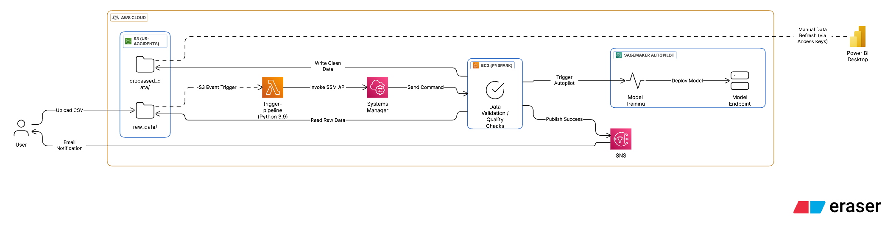

# AWS Big Data & MLOps Pipeline - US Traffic Safety Intelligence

An end-to-end automated data pipeline built on AWS. A raw CSV uploaded to S3 triggers the entire workflow: PySpark processing on EC2, processed data saved back to S3, SageMaker Autopilot ML training, and an SNS status notification, all without manual intervention.

**[Live Power BI Dashboard](https://app.powerbi.com/view?r=eyJrIjoiNTg4Y2ZhNDUtZjRjMC00MjExLTljZWYtYWU3MDM3MzJmYjExIiwidCI6IjExMTNiZTM0LWFlZDEtNGQwMC1hYjRiLWNkZDAyNTEwYmU5MSIsImMiOjN9)** | **[Demo Video](https://iu.mediaspace.kaltura.com/media/t/1_rirkff4s)**

---

## Architecture



**Flow:** S3 Upload → Lambda → EC2 (PySpark) → S3 (Processed) → SageMaker Autopilot → SNS

---

## Tech Stack

| Layer | Service |
|---|---|
| Storage | AWS S3 |
| Compute | AWS EC2 (Linux) |
| Processing | PySpark (Distributed) |
| Trigger | AWS Lambda + S3 Event |
| Remote Execution | AWS SSM |
| ML | SageMaker Autopilot |
| Notifications | AWS SNS |
| Visualization | Microsoft Power BI |

---

## Dataset

**US Accidents (2016–2023)** - Kaggle ([source](https://www.kaggle.com/datasets/sobhanmoosavi/us-accidents/data))

- 500,000 records, 49 columns
- Covers 49 US states
- Data sourced from US/state DOTs, law enforcement, traffic cameras, and sensors
- Target variable: `Severity` (1-4)

---

## Pipeline

### Task 1 - Data Ingestion
PySpark reads the raw CSV directly from S3 (`s3a://us-accidents/raw_data/`) using the Hadoop-AWS connector.

### Task 2 - Data Processing
**Cleaning:**
- Drops 14 irrelevant columns (IDs, descriptions, redundant geospatial fields)
- Removes duplicates, drops rows missing coordinates or timestamps
- Fills null weather fields with `0.0` / `"Unknown"`

**Feature Engineering:**
- Extracts `year`, `month`, `hour`, `day_of_week` from `start_time`
- Calculates `duration_min` (accident clearance time in minutes)
- Flags `is_rush_hour` (7-9 AM, 4-6 PM) and `is_weekend`

**Aggregations (5 key metrics):**
1. State Hotspots - states with highest accident volume
2. Rush Hour Impact - accident count and avg severity during peak vs. off-peak hours
3. Weather Severity - weather conditions correlated with accident severity
4. Infrastructure Safety - accident frequency at traffic signals vs. open roads
5. City Clearance Time - cities ranked by average scene-clearing duration

### Task 3 - Storage
Processed data written back to S3 in two streams:
- `processed_data/master_clean/` - full cleaned dataset for reporting
- `processed_data/ml_ready/` - stripped-down dataset for ML training

### Task 4 - Spark SQL Analysis
Five SQL queries run against a registered temp view:
1. Top 10 cities by accident count
2. Accident count by day of week
3. States with highest average severity
4. Average severity by visibility range (Very Low / Low / Normal)
5. Monthly accident trend (seasonal patterns)

### Task 5 - SageMaker Autopilot
- Reads from `processed_data/ml_ready/`
- Target column: `severity` (multiclass classification)
- Trains 10+ candidate models, max 1 hour total runtime
- Best model: **84.2% accuracy, F1 Score: 0.415**
- Top predictor: `distance_mi` (18.6%) - physical length of the traffic impact zone
- Limitation: class imbalance causes the model to over-predict Severity 2 and miss Severity 4 (fatal) cases, only 21 of 244 fatal cases correctly identified

---

## Automation

**Trigger:** S3 `PUT` event on `raw_data/` → fires Lambda function

**Lambda** (`lambda_function.py`): Uses AWS SSM `send_command` to remotely execute the pipeline script on the EC2 instance.

**Notifications:** SNS topic `accidents-pipeline-alerts` sends email on both success and failure with job details or error trace.

**IAM setup required:**
- EC2 role: `AmazonS3FullAccess`, `AmazonSNSFullAccess`, `AmazonSageMakerFullAccess`, `AmazonSSMManagedInstanceCore`
- Lambda execution role: `AmazonSSMFullAccess`
- SageMaker execution role: `AmazonS3FullAccess`

---

## Power BI Dashboard

5 visualizations built on the processed dataset (38 fields):

1. **Geospatial Risk Map** - accident coordinates color-coded by severity; East/West Coast density vs. inland highway severity
2. **City Inefficiencies Treemap** - cities ranked by average accident clearance time (Miami, Orlando, LA as top bottlenecks)
3. **Temporal Risk Heatmap** - accident frequency by day-of-week × hour-of-day (commuter matrix)
4. **Environmental Impact Chart** - accident volume by weather condition, stacked by severity level
5. **Infrastructure Safety Audit** - average traffic impact distance at traffic signals vs. open roads

---

## Files

```
├── accidents_data_pipeline.py     # Main PySpark pipeline (run on EC2)
├── lambda_function.py             # Lambda trigger via SSM
└── aws-pipeline.png               # Architecture diagram
```

---

## Running the Pipeline

1. Create an S3 bucket (`us-accidents`) with folders `raw_data/` and `processed_data/`
2. Set up an EC2 instance (Linux), install PySpark, configure AWS CLI
3. Copy `accidents_data_pipeline.py` to `/home/ec2-user/scripts/` on the EC2 instance
4. Update ARNs in `accidents_data_pipeline.py` (SNS topic, SageMaker role, bucket name)
5. Update `EC2_INSTANCE_ID` in `lambda_function.py`
6. Deploy `lambda_function.py` as a Lambda function, attach SSM permission, add S3 event trigger on `raw_data/`
7. Upload the dataset CSV to `s3://us-accidents/raw_data/` - pipeline starts automatically